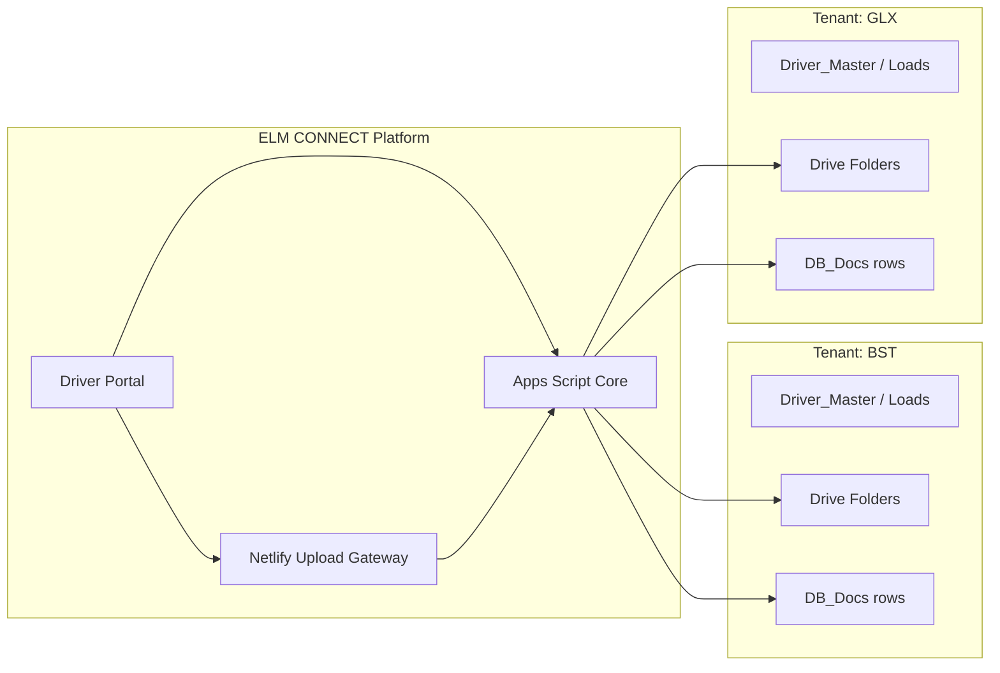
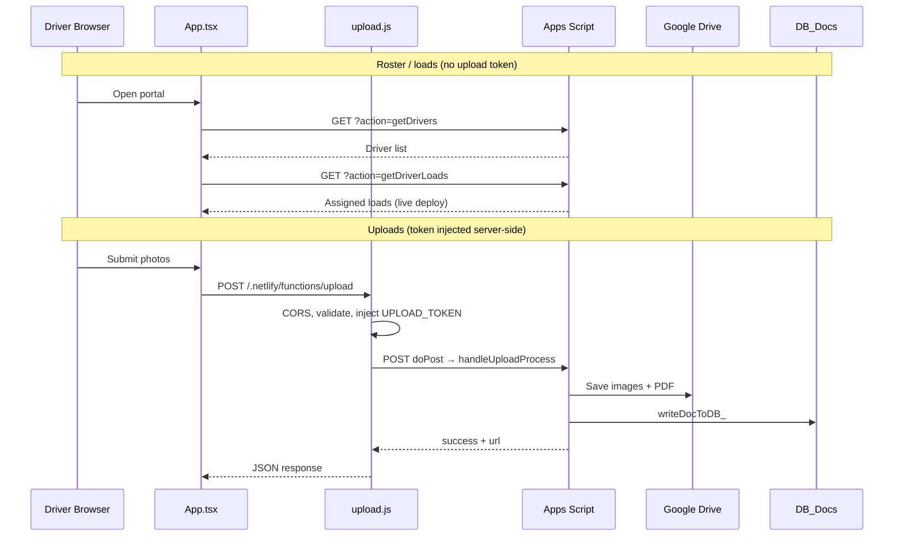

# ELM CONNECT AI Development Standard

**Version 1.0**  
**Document classification:** Internal — AI agents, developers, platform operators  
**Last updated:** 1 July 2026  
**Maintained by:** ELM CONNECT Platform Team

---

## How to Use This Document

This manual is the **operating standard for AI-assisted development** on ELM CONNECT. It tells Cursor agents, other AI coding tools, and human developers how to work safely in this repository without breaking production uploads, tenant isolation, or driver workflows.

**Read these first for full context:**

| Document | Role |
|----------|------|
| [ELM_CONNECT_Enterprise_Platform_Standards_v1.0.md](./ELM_CONNECT_Enterprise_Platform_Standards_v1.0.md) | Authoritative platform handbook (business + technical appendix) |
| [AGENTS.md](../AGENTS.md) | Quick repo map and agent guardrails |
| [.cursor/rules/elm-connect-platform.mdc](../.cursor/rules/elm-connect-platform.mdc) | Always-on Cursor rule for this workspace |

### Table of contents

1. [Executive Summary](#1-executive-summary)
2. [Project Identity](#2-project-identity)
3. [Architecture Principles](#3-architecture-principles)
4. [Current Technical Stack](#4-current-technical-stack)
5. [Source-of-Truth Rules](#5-source-of-truth-rules)
6. [Standard Development Workflow](#6-standard-development-workflow)
7. [GAS / clasp Workflow](#7-gas--clasp-workflow)
8. [Netlify Workflow](#8-netlify-workflow)
9. [Security Rules](#9-security-rules)
10. [Data Integrity](#10-data-integrity)
11. [UI/UX Rules](#11-uiux-rules)
12. [Testing Checklist](#12-testing-checklist)
13. [Deployment Checklist](#13-deployment-checklist)
14. [Incident Response](#14-incident-response)
15. [AI Agent Behavior Rules](#15-ai-agent-behavior-rules)
16. [Appendix — Reusable Prompt Snippets](#16-appendix--reusable-prompt-snippets)

---

## 1. Executive Summary

ELM CONNECT uses AI-assisted development to move faster while keeping **one consistent standard** across the driver portal, upload gateway, Google Apps Script (GAS) backend, and tenant data.

**Purpose of this document:** Give every agent and developer the same playbook so changes are small, verifiable, and safe for production drivers who depend on BOL/POD uploads daily.

**Core promise to operators:** AI tools may suggest code, but **humans and agents must not**:

- Break the upload pipeline (`App.tsx` → `netlify/functions/upload.js` → `gas/02_App_UploadHandler.js`)
- Mix tenant data (BST vs GLX)
- Expose secrets in the browser or git
- Claim features exist when they are only planned (SSO, PostgreSQL, full employee portal)

**When in doubt:** Read the handbook, inspect the file you are changing, make the smallest correct change, and report any manual deployment steps the owner must run.

---

## 2. Project Identity

### What ELM CONNECT is

**ELM CONNECT** (Elite Logistics Manager Connect) is the **platform** — shared software, deployment, security rules, and standards. It is **not** a trucking company.

### Tenants (organizations on the platform)

| Tenant | Code | Role today |
|--------|------|------------|
| BST Expedite | `BST` | Active tenant — drivers, loads, documents |
| Greenleaf Xpress | `GLX` | Active tenant — drivers, loads, documents |
| Future orgs | TBD | Must follow same isolation model |

### Company isolation (non-negotiable)

Every driver, load, document intake row, Drive folder, and notification must be scoped to **one company**. A GLX document must never land in a BST folder. A BST driver must never appear in GLX configuration unless explicitly cross-listed in roster data (rare; requires owner approval).



**Repository:** `c:\Users\vtayl\OneDrive\Desktop\qlm-bol-uploader` (GitHub: qlm-bol-uploader)

---

## 3. Architecture Principles

ELM CONNECT is organized by **domain**, not by a single monolithic script. When adding features, identify the domain first.

| Domain | Scope | Primary files / data today |
|--------|-------|---------------------------|
| **Platform** | Cross-tenant infra, gateway, secrets, deployment | `netlify.toml`, `netlify/functions/upload.js`, `gas/06_App_Utils.js` |
| **Organization / Tenant** | BST, GLX, future `organization_id` | `gas/00_App_Config.js`, `COMPANY_MAP` in `upload.js` |
| **Driver** | Roster, session, operator selection | `gas/03__App_DriverLookup.js`, `Driver_Master` sheet, `components/TerminalLogin.tsx` |
| **Document** | BOL, POD, freight photos, PDF, intake | `gas/02_App_UploadHandler.js`, `gas/04_App_DocIntakeWriter.js`, `DB_Docs` |
| **Dispatch** | Load assignment, auto vs manual mode | `App.tsx` (`getDriverLoads`, `manualMode`, stages) |
| **Payroll** | Planned | Handbook §9 — design with `organization_id`; not live in this repo |
| **Finance** | Planned | Future module |
| **Workflow** | Driver portal stages and fallbacks | `App.tsx` — `EVENT` → `OPERATOR` → `ASSIGNMENT` → `EVIDENCE` → `REVIEW` |
| **AI** | Planned | Isolated per tenant; no live AI services in upload path today |

### Layered request flow



---

## 4. Current Technical Stack

| Layer | Technology | Notes |
|-------|------------|-------|
| **Frontend** | React 19 + TypeScript + Vite + Tailwind | Entry: `App.tsx`; build → `dist/` |
| **Hosting** | Netlify | `netlify.toml`: Node 20, `npm run build`, publish `dist` |
| **API gateway** | Netlify Functions | `netlify/functions/upload.js` — upload path only |
| **Backend** | Google Apps Script (GAS) | `gas/*.js` — roster, upload processing, notifications |
| **Structured data** | Google Sheets | `SETTINGS.SPREADSHEET_ID` in `gas/00_App_Config.js` |
| **File storage** | Google Drive | Per-tenant folder IDs in `SETTINGS.FOLDERS` |
| **Source control** | GitHub | This repository |
| **GAS deployment** | clasp (recommended) | Local `gas/` ↔ bound Apps Script project |
| **CI/build** | Netlify on push | No separate GitHub Actions required for portal deploy |

### Honest current-state notes

| Area | Today | Do not assume |
|------|-------|---------------|
| Driver auth | Roster selection + `TerminalLogin`; splash is cosmetic | Full SSO is live |
| Staff auth | `public/auth.html` scaffold | Employee portal wired |
| Data store | Sheets + Drive | PostgreSQL tables exist |
| Load scan | `App.tsx` calls `getDriverLoads` | Handler exists in repo `01_App_routes.js` (verify live GAS) |
| clasp config | `.clasp.json` not in repo | May exist only on maintainer machine |

### Key environment variables (Netlify)

| Variable | Required | Purpose |
|----------|----------|---------|
| `UPLOAD_TOKEN` | Yes | Shared secret; gateway injects, GAS validates |
| `APPS_SCRIPT_WEB_APP_URL` | Yes | Server-side forward target for uploads |
| `ALLOWED_ORIGINS` | Yes | Comma-separated portal origins for CORS |

Missing any required variable → gateway returns **500 Server configuration error** (fail closed).

---

## 5. Source-of-Truth Rules

Multiple systems hold pieces of truth. Agents must know **which system wins** for each concern.

| Concern | Source of truth | Secondary / mirror |
|---------|-----------------|-------------------|
| Application source code | **GitHub repo** (this workspace) | Netlify build artifact (`dist/`) |
| GAS server logic | **Bound Apps Script project** (deployed) | `gas/` in repo — must be pushed via clasp |
| Upload secrets | **Netlify env** + **GAS Script Properties** | Never in repo or client |
| Driver roster | **`Driver_Master` sheet** | `getDrivers` reads live sheet |
| Document intake audit | **`DB_Docs` sheet** | Written by `writeDocToDB_` |
| Drive files | **Google Drive** | URLs stored in `DB_Docs` |
| Portal URL / CORS | **Netlify site URL** | `ALLOWED_ORIGINS` must match |
| Platform policy | **`docs/ELM_CONNECT_Enterprise_Platform_Standards_v1.0.md`** | This document for AI workflow |

### When to `clasp push`

Push GAS changes when you have edited any file under `gas/` and the owner wants those changes live:

1. `clasp status` — confirm local vs remote diff
2. `clasp push` — upload `.js` files to bound project
3. **New deployment** — if web app URL or execution identity changed, create a new GAS deployment (see §7)
4. Smoke test: `ping`, `getDrivers`, test upload via gateway

### When a new GAS deployment is required

| Change | Push enough? | New deployment? |
|--------|--------------|-----------------|
| Edit handler logic inside existing deployment | Yes, after push | Usually no |
| Change web app execute-as / access settings | — | **Yes** |
| First-time web app publish | — | **Yes** |
| `APPS_SCRIPT_WEB_APP_URL` must change | — | **Yes** — update Netlify env to match |

### Repo vs live parity warning

`App.tsx` embeds `GOOGLE_SCRIPT_URL` for roster/load GET requests. `netlify/functions/upload.js` uses `APPS_SCRIPT_WEB_APP_URL` for POST uploads. These **should** point at the same GAS web app deployment; if they diverge, roster and upload behavior will disagree.

**Known gap:** Repo `gas/01_App_routes.js` routes `ping` and `getDrivers` only. `App.tsx` also calls `getDriverLoads`. Confirm the **live** GAS project implements that route before assuming auto-assignment works from repo alone.

---

## 6. Standard Development Workflow

Every AI agent or developer should follow this sequence:

### Step 1 — Read context

1. [AGENTS.md](../AGENTS.md)
2. Relevant handbook section (Driver §D, Document §E, Workflow §G, Appendix Q/R)
3. `.cursor/rules/elm-connect-platform.mdc`
4. This document

### Step 2 — Inspect before editing

Open the files you will touch. Trace the full path (e.g., upload: client → gateway → GAS → Drive → `DB_Docs`).

### Step 3 — Small, focused changes

- One concern per change set
- Match existing naming (`gas/0N_App_*.js`, patterns in `App.tsx`)
- Do not refactor unrelated code
- Align validation in **all three layers** when changing file rules: `utils/uploadFileRules.ts`, `upload.js`, GAS expectations

### Step 4 — Preserve the upload pipeline

Never route uploads directly from React to GAS. The gateway must stay in path for token injection and server validation.

### Step 5 — Build and basic verification

```bash
npm run build
```

There is no automated test suite today (`package.json` test script is a placeholder). Manual checklist: §12.

### Step 6 — Commit milestones

- Commit only when the user or task requests it
- Never commit secrets (`.env`, tokens, `.clasp.json` if it contains sensitive project IDs you were told to exclude)
- Use clear commit messages describing *why*

### Step 7 — Report manual steps

Always tell the owner if they must:

- `clasp push` and/or create new GAS deployment
- Update Netlify environment variables
- Redeploy Netlify site
- Run one-time sheet migration (e.g., `reverseDB_DocsOrderOnce_`)
- Verify Gmail "Send mail as" alias for GLX

---

## 7. GAS / clasp Workflow

### Local layout

All GAS source lives in `gas/`:

| File | Responsibility |
|------|----------------|
| `00_App_Config.js` | `SETTINGS` — spreadsheet ID, `FOLDERS`, `EMAILS`, `GLX_SENDER`, SMS |
| `01_App_routes.js` | `doGet` / `doPost` routing |
| `02_App_UploadHandler.js` | Upload decode, Drive, PDF, notifications, intake trigger |
| `03__App_DriverLookup.js` | `getDriversData()` — roster gate |
| `04_App_DocIntakeWriter.js` | `DB_Docs` append, `DocIntakeId` |
| `05_App_Notifications.js` | Email + SMS |
| `06_App_Utils.js` | `UPLOAD_TOKEN` auth, company allow list, diagnostics |

### clasp setup (maintainer machine)

`.clasp.json` is **not** currently tracked in this repository. Maintainers typically create it locally:

```bash
npm install -g @google/clasp
clasp login
clasp clone <SCRIPT_ID>   # or clasp create --type webapp
```

Example `.clasp.json` (local only — add to `.gitignore` if it contains environment-specific IDs):

```json
{
  "scriptId": "<YOUR_APPS_SCRIPT_PROJECT_ID>",
  "rootDir": "gas"
}
```

### Standard clasp commands

| Command | When to use |
|---------|-------------|
| `clasp status` | Before push — see which files differ |
| `clasp push` | After editing `gas/*.js` |
| `clasp open` | Open project in browser editor |
| `clasp deployments` | List deployment IDs and web app URLs |
| `clasp deploy` | Create new versioned deployment when needed |

### Script Properties (GAS console)

| Key | Purpose |
|-----|---------|
| `UPLOAD_TOKEN` | Must match Netlify `UPLOAD_TOKEN` exactly |
| `DB_DOCS_ORDER_REVERSED` | Set to `1` after one-time `reverseDB_DocsOrderOnce_` migration |

**Never** log or return raw token values. `getUploadAuthDiag_` in `06_App_Utils.js` logs metadata only via `console.log("[upload-auth-diag]", ...)`.

### Verify after GAS deploy

1. `GET <webAppUrl>?action=ping` → `{ ok: true, app: "ELM_UPLOADER", ... }`
2. `GET <webAppUrl>?action=getDrivers` → JSON array of driver names
3. Test upload through `/.netlify/functions/upload` (not direct GAS POST from browser)

---

## 8. Netlify Workflow

### Build configuration (`netlify.toml`)

- **Node:** 20
- **Build:** `npm run build`
- **Publish:** `dist`
- **Cache:** `index.html` — 300s; `/assets/*` — 1 year immutable

### Functions

- Upload gateway: `netlify/functions/upload.js`
- Invoked at: `/.netlify/functions/upload`
- Auto-deployed when pushed to connected branch (typically `main`)

### Environment variables

Set in Netlify UI: **Site settings → Environment variables**

| Variable | Example shape | Notes |
|----------|---------------|-------|
| `UPLOAD_TOKEN` | Long random string | Same value in GAS Script Properties |
| `APPS_SCRIPT_WEB_APP_URL` | `https://script.google.com/macros/s/.../exec` | Used only server-side in `forwardToAppsScript` |
| `ALLOWED_ORIGINS` | `https://your-site.netlify.app,https://custom.domain` | No trailing slashes; comma-separated |

### Redeploy and cache busting

- **New deploy:** Push to connected branch or trigger manual deploy in Netlify
- **HTML changes:** Short cache on `index.html` — users pick up within ~5 minutes
- **Hashed assets:** New build produces new filenames — automatic cache bust
- **Functions:** Redeploy site after env var changes

### Gateway behavior summary (`upload.js`)

- OPTIONS → 204 with CORS
- Validates origin against `ALLOWED_ORIGINS`
- Validates company (`COMPANY_MAP`), driver, BOL, files (JPG/PNG; blocks HEIC/PDF/WEBP/video)
- Limits: 20 files, 10 MB/file, 50 MB total
- Injects `uploadToken` in `buildAppsScriptPayload` — **never** accept token from client body as authoritative

### Diagnostics

Netlify function logs use `[upload-diag]` JSON lines with `validationStage` — safe for troubleshooting without printing secrets.

---

## 9. Security Rules

### Mandatory rules for all agents

1. **No secrets in frontend** — `UPLOAD_TOKEN` must not appear in `App.tsx`, bundles, or public URLs.
2. **No direct React → GAS upload** — Always `/.netlify/functions/upload`.
3. **Gateway required** — CORS, origin check, validation, token injection.
4. **Token validation** — GAS `isUploadAuthorized_` strict string match against Script Property.
5. **Safe logging** — Log stages and lengths, never full tokens (`logUploadDiag`, `[upload-auth-diag]`).
6. **No fake success UI** — Show success only on confirmed `{ success: true }` or GAS `status: "success"`.
7. **Tenant allow list** — Only `BST` and `GLX` unless owner expands `isAllowedUploadCompany_` and `COMPANY_MAP`.
8. **Roster gate** — `ShowInUploader` + `IsActive` on `Driver_Master`.
9. **Manual fallback** — Must remain logged (`DB_Docs`, driver name) — not anonymous.
10. **Splash / lock screen** — `isLocked` / `authStage` is **UX only**, not authentication.

### Defense in depth (uploads)

| Layer | File | Checks |
|-------|------|--------|
| Client | `utils/uploadFileRules.ts` | MIME/category, block PDF/WEBP/video; HEIC → compress path |
| Gateway | `netlify/functions/upload.js` | Origin, company map, size, HEIC block on wire |
| GAS | `02_App_UploadHandler.js`, `06_App_Utils.js` | Token, company, processing |

### What not to weaken without owner approval

- `ALLOWED_ORIGINS`
- `isAllowedUploadCompany_`
- Roster column requirements
- Upload size/type limits
- Removal of intake logging

---

## 10. Data Integrity

### loadNum vs bolNum vs loadId

| Field | Meaning | Usage |
|-------|---------|--------|
| `loadNum` | Dispatch load number | From assigned load or manual context; may be `NA` in manual mode |
| `bolNum` | Bill of lading / reference number | **Required** at gateway validation |
| `loadId` | Stable load record ID | Returned by `getDriverLoads` when available; used client-side for leg disambiguation |

In GAS upload handler: `cleanLoad = loadNum || bolNum || "NA"` — used for file naming, PDF title, notifications, and `DB_Docs.LoadNumber`.

**Agent rule:** Do not collapse these fields into one input without explicit product approval. `App.tsx` intentionally separates manual BOL entry from auto load selection.

### DB_Docs mappings (`04_App_DocIntakeWriter.js`)

Header-driven column map — sheet headers must match:

| Header | Set on intake |
|--------|---------------|
| `DocIntakeId` | `DIN-` + SHA-256 prefix |
| `Timestamp` | Now |
| `Company` | Tenant code |
| `Driver` | Display name |
| `LoadNumber` | `cleanLoad` |
| `DocumentPhase` | `BOL` or `POD` |
| `Origin` / `Destination` | Formatted city, state |
| `DocumentUrl` | PDF Drive URL |
| `MatchStatus` | `NEW` |
| `SourceApp` | `UPLOADER` |
| `UploaderVersion` | `v7_mapped` |
| `CanonicalDriverId` | From `Drivers` sheet lookup |
| `MatchedLoadId` | Empty on intake |

### Newest-first order

`writeDocToDB_` uses `insertRowBefore(2)` so new intakes appear at the top. Historical data may require one-time `reverseDB_DocsOrderOnce_()` (guarded by Script Property `DB_DOCS_ORDER_REVERSED`).

### Future: companyId / tenantId

Design new fields with `organization_id` or `companyId` in mind. Today the canonical tenant key is **`Company`** column (`BST` / `GLX`).

---

## 11. UI/UX Rules

### Driver Terminal baseline

- `App.tsx` + `components/TerminalLogin.tsx` define the **Driver Terminal** experience
- Five stages: `EVENT` → `OPERATOR` → `ASSIGNMENT` → `EVIDENCE` → `REVIEW`
- Dark terminal aesthetic, operational tone — not a marketing landing page

### ELM CONNECT identity

- Platform branding: **ELM CONNECT**
- Tenant names shown in context (BST Expedite Inc, Greenleaf Xpress)
- Do not rebrand to QLM or legacy names unless owner requests

### Change discipline

| Do | Don't |
|----|-------|
| Fix bugs and clarity issues | Redesign entire flow without approval |
| Preserve `multi_vault` offline resilience | Remove local retry storage silently |
| Mobile-first (drivers on phones) | Desktop-only layouts |
| Show truthful errors from API | Generic "Success" on failure |
| Keep manual fallback path visible | Hide manual mode when loads fail |

### Success and failure states

- Upload success: require server confirmation before final REVIEW success UI
- Auth errors: show `Unauthorized` / gateway errors clearly
- Load scan failure: offer manual mode (`loadSelectionError` path)

---

## 12. Testing Checklist

Run after meaningful changes. Check each box that applies.

### Portal / roster

- [ ] Portal loads on target origin (production or preview URL)
- [ ] `getDrivers` returns expected active drivers only
- [ ] Driver not in roster does not appear
- [ ] `TerminalLogin` session read/clear works

### Assigned load (auto mode)

- [ ] `getDriverLoads` returns loads for test driver (live GAS)
- [ ] Selecting load sets company and route fields
- [ ] Duplicate load numbers remain selectable as separate legs (`loadId`)

### Manual fallback

- [ ] Manual mode activates when load scan fails or user chooses it
- [ ] Carrier dropdown sets company (`BST Expedite Inc` / `Greenleaf Xpress`)
- [ ] Submission still logs driver name and creates `DB_Docs` row

### Upload path

- [ ] JPG/PNG upload succeeds via `/.netlify/functions/upload`
- [ ] HEIC rejected at gateway with helpful message
- [ ] PDF/WEBP/video rejected at client and/or gateway
- [ ] Oversized file rejected
- [ ] Wrong origin rejected (403)

### Backend artifacts

- [ ] Images appear in correct tenant folder (`SETTINGS.FOLDERS`)
- [ ] PDF compiled in bol or pod folder per `bolProtocol`
- [ ] `DB_Docs` new row at top with `DocIntakeId`, `MatchStatus: NEW`
- [ ] Email sent to `SETTINGS.EMAILS[company]`
- [ ] GLX email uses `maintenance@greenleafxpressllc.com` when alias configured
- [ ] SMS gateway email fired to `SETTINGS.SMS_GATEWAY`

### Logs

- [ ] Netlify function log shows `[upload-diag]` stages through `response_success`
- [ ] GAS Executions log shows no uncaught errors
- [ ] On 401: check token parity Netlify ↔ Script Properties (not in client)

---

## 13. Deployment Checklist

Use this for production releases.

### Pre-deploy

- [ ] `git status` clean for intended files only
- [ ] `npm run build` succeeds locally
- [ ] No secrets in diff
- [ ] Handbook / `AGENTS.md` updated if behavior changed

### GAS

- [ ] `clasp status` reviewed
- [ ] `clasp push` completed
- [ ] New deployment created if web app settings changed
- [ ] `?action=ping` OK
- [ ] `?action=getDrivers` OK
- [ ] `getDriverLoads` verified on **live** deployment if auto mode used

### Netlify

- [ ] `UPLOAD_TOKEN` set (prod context)
- [ ] `APPS_SCRIPT_WEB_APP_URL` matches current GAS deployment
- [ ] `ALLOWED_ORIGINS` includes live portal URL(s)
- [ ] Deploy completed without build errors

### Smoke test (production)

- [ ] Open portal → select driver → complete one test upload
- [ ] Confirm Drive file + `DB_Docs` row + email
- [ ] Clear test data or mark row in intake notes if needed

---

## 14. Incident Response

Quick triage by symptom. Full playbook: handbook §14.

| Symptom | Likely layer | First actions |
|---------|--------------|---------------|
| **Unauthorized (401)** | Token mismatch | Compare Netlify `UPLOAD_TOKEN` vs GAS Script Property; redeploy both sides; check GAS `[upload-auth-diag]` log metadata |
| **Upload fail (400)** | Validation / GAS | Read Netlify `[upload-diag]` stage; check company code, BOL, file types |
| **Drive fail** | GAS permissions / folder IDs | Verify `SETTINGS.FOLDERS`; run `triggerPermissions()` if needed; check GAS execution error |
| **DB_Docs fail** | Sheet structure | Confirm `DB_Docs` sheet and headers exist; check `writeDocToDB_` column map |
| **Wrong email account (GLX)** | Gmail alias | Run `testGlxSenderAliases()` in GAS; verify Send mail as alias; watch for `GLX_SENDER_ALIAS_MISSING` |
| **Netlify deploy fail** | Build / env | Read build log; fix TypeScript/build errors; confirm Node 20 |
| **Roster empty** | Sheet / `getDrivers` | Check `Driver_Master` flags; sheet name; GAS deployment version |
| **Auto loads missing** | `getDriverLoads` | Confirm route exists on live GAS, not only in `App.tsx` |

### Containment

1. Stop further deploys if tenant routing is wrong
2. Rotate `UPLOAD_TOKEN` if leak suspected
3. Notify tenant contacts from `SETTINGS.EMAILS`
4. Document timeline and root cause within five business days

---

## 15. AI Agent Behavior Rules

### Be conservative

Production serves real drivers. Prefer **diagnosis** and **minimal diffs** over large rewrites.

### Do not invent facts

- If a route is not in repo, say so (e.g., `getDriverLoads`)
- If SSO is planned, do not claim it is enforced
- If PostgreSQL is future, do not add fake Supabase clients unless asked

### Do not overwrite working systems

- Read existing patterns before adding libraries
- Do not replace Sheets/Drive with a new database in drive-by changes
- Do not remove `multi_vault` without explicit resilience redesign

### Do not weaken security

- No "temporary" bypass of origin or token checks
- No committing `.env` or tokens
- No exposing `authDiag` details to browser (production recommendation)

### Diagnosis vs implementation

| User intent | Agent action |
|-------------|--------------|
| "Why does upload fail?" | Trace logs, env, token parity — explain before coding |
| "Fix upload fail" | Smallest fix + test checklist |
| "Redesign portal" | Confirm scope with user; preserve workflow stages |

### Explain changes

After edits, summarize:

- What changed and why
- Files touched
- Manual deploy steps (clasp, Netlify env, GAS deployment)
- What was **not** changed and why

### Commits

Only commit when the user or task explicitly requests it. Stage only relevant files.

---

## 16. Appendix — Reusable Prompt Snippets

Copy and adapt these prompts in Cursor or other AI tools.

### A. Secure upload debug

```
Debug ELM CONNECT upload failure without weakening security.

Read: AGENTS.md, docs/ELM_CONNECT_AI_DEVELOPMENT_STANDARD_v1.md, netlify/functions/upload.js, gas/02_App_UploadHandler.js, gas/06_App_Utils.js.

Trace: App.tsx POST /.netlify/functions/upload → gateway validation → GAS isUploadAuthorized_ → Drive → DB_Docs.

Check: ALLOWED_ORIGINS, UPLOAD_TOKEN parity (Netlify env vs GAS Script Properties), APPS_SCRIPT_WEB_APP_URL, company code BST/GLX.

Use [upload-diag] and GAS execution logs. Do not expose tokens in client or commit secrets. Report root cause and minimal fix.
```

### B. clasp deploy

```
Deploy GAS changes for ELM CONNECT.

Files live in gas/. .clasp.json may be local only.

Steps: clasp status → clasp push → verify ?action=ping and ?action=getDrivers → confirm whether new web app deployment is needed → if URL changed, update Netlify APPS_SCRIPT_WEB_APP_URL.

List manual steps for the owner after code changes.
```

### C. Netlify env check

```
Verify Netlify configuration for ELM CONNECT upload gateway.

Required env: UPLOAD_TOKEN, APPS_SCRIPT_WEB_APP_URL, ALLOWED_ORIGINS.

Read netlify.toml and netlify/functions/upload.js validateServerConfig().

Explain what fails when each variable is missing. Do not print actual secret values.
```

### D. DB_Docs writer change

```
Change DB_Docs intake for ELM CONNECT.

Start at gas/04_App_DocIntakeWriter.js writeDocToDB_.

Preserve: header-driven column map, DocIntakeId generation, insertRowBefore(2) newest-first, Company tenant scope, MatchStatus NEW on intake.

If adding columns, document required DB_Docs sheet headers. Cross-check handbook Document Domain §E.
```

### E. UI preservation

```
Modify App.tsx for ELM CONNECT Driver Terminal without redesign.

Preserve: five stages EVENT→REVIEW, manualMode fallback, multi_vault offline storage, TerminalLogin session, auto vs manual carrier rules, truthful upload success/failure.

Mobile-first. No UPLOAD_TOKEN in client. Uploads only via /.netlify/functions/upload.
```

### F. Security review

```
Security review of ELM CONNECT changes (branch or described diff).

Verify: no secrets in client/git, upload path goes through Netlify gateway, tenant isolation BST/GLX, roster gate, server-side file validation, manual fallback logged, no security theater from splash screen.

Reference: docs/ELM_CONNECT_Enterprise_Platform_Standards_v1.0.md Appendix Q, AGENTS.md security rules.

List findings: critical / warning / informational.
```

---

## Document history

| Version | Date | Changes |
|---------|------|---------|
| 1.0 | 1 July 2026 | Initial AI development standard |

**Related documents:** [Enterprise Platform Standards v1.1](./ELM_CONNECT_Enterprise_Platform_Standards_v1.0.md) · [AGENTS.md](../AGENTS.md) · [Executive Brief](./ELM_CONNECT_Executive_Brief_v1.0.md)
