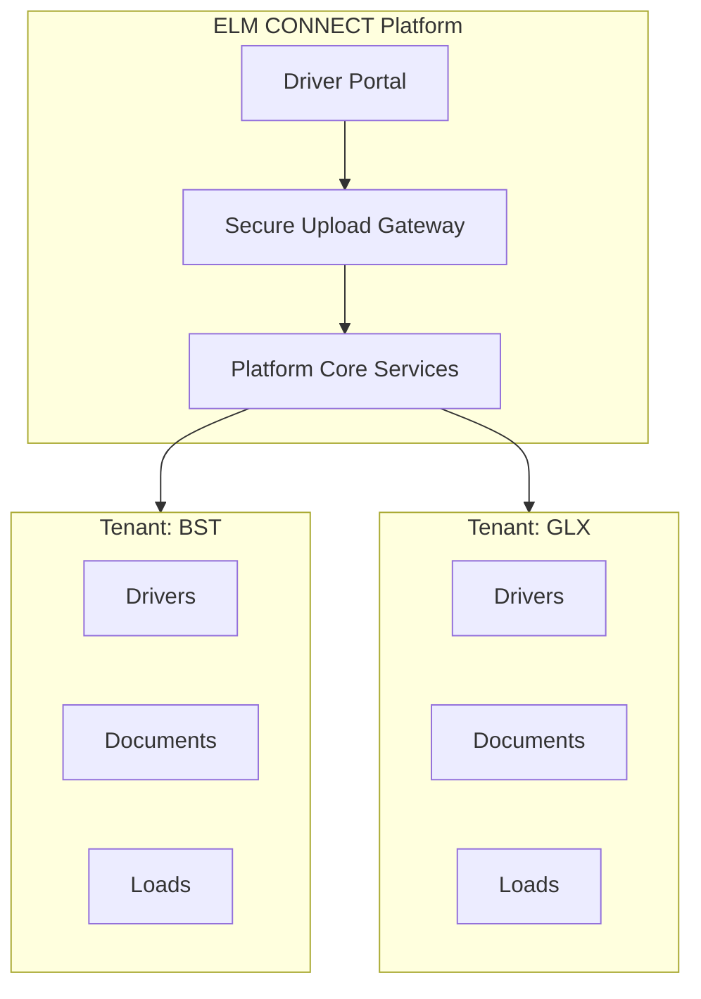
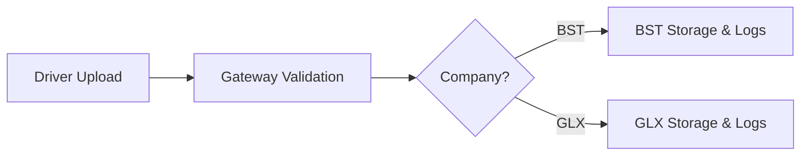
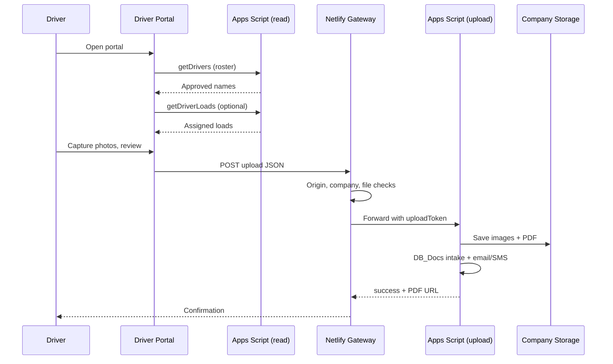
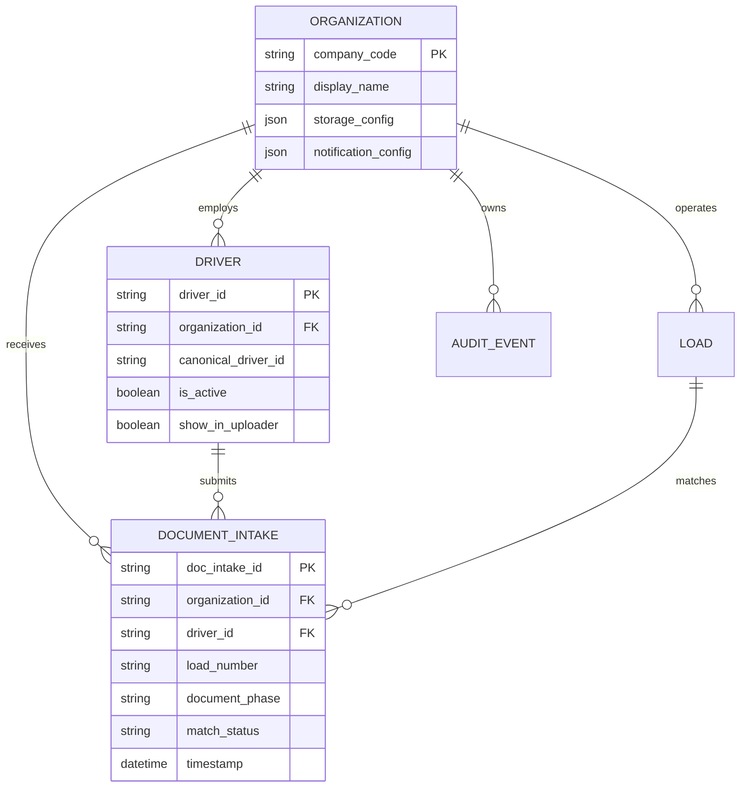

# ELM CONNECT Enterprise Platform Standards

**Version 1.1**  
**Document classification:** Internal / Partner / Security Review  
**Last updated:** 1 July 2026  
**Maintained by:** ELM CONNECT Platform Team

---

## How to Use This Document

This handbook is the authoritative reference for how ELM CONNECT is designed, secured, and governed. It is written for transportation executives and company owners first. A technical appendix at the end supports developers, security reviewers, and AI-assisted development tools.

**Related documents**

| Document | Audience | Location |
|----------|----------|----------|
| Executive Brief (1 page) | Owners, partners, insurance | [ELM_CONNECT_Executive_Brief_v1.0.md](./ELM_CONNECT_Executive_Brief_v1.0.md) |
| Agent instructions | Cursor / AI developers | [AGENTS.md](../AGENTS.md) |
| AI development standard | AI agents, developers, operators | [ELM_CONNECT_AI_DEVELOPMENT_STANDARD_v1.md](./ELM_CONNECT_AI_DEVELOPMENT_STANDARD_v1.md) |
| Repository overview | Developers | [README.md](../README.md) |

### Table of contents

**Part I — Business & Governance**

1. [Executive Summary](#1-executive-summary)
2. [Vision](#2-vision)
3. [Architecture Principles](#3-architecture-principles)
4. [Security & Governance](#4-security--governance)
5. [Identity & Access Management](#5-identity--access-management)
6. [Multi-Tenant Model](#6-multi-tenant-model)
7. [Data Ownership](#7-data-ownership)
8. [Document Management](#8-document-management)
9. [Payroll Standards](#9-payroll-standards)
10. [Dispatch Standards](#10-dispatch-standards)
11. [AI Principles](#11-ai-principles)
12. [Development Standards](#12-development-standards)
13. [Production Deployment](#13-production-deployment)
14. [Disaster Recovery](#14-disaster-recovery)
15. [Future Cloud Migration](#15-future-cloud-migration)
16. [Frequently Asked Questions](#16-frequently-asked-questions)

**Part II — Technical Appendix**

- [A. Domain Model](#a-domain-model-overview)
- [B. Platform Domain](#b-platform-domain)
- [C. Organization Domain](#c-organization-domain)
- [D. Driver Domain](#d-driver-domain)
- [E. Document Domain](#e-document-domain)
- [F–H. Planned domains](#f-payroll-domain) (Payroll, Workflow, AI)
- [I. Authentication](#i-authentication)
- [J. Authorization](#j-authorization)
- [K. Tenant Isolation](#k-tenant-isolation)
- [L. Secrets](#l-secrets)
- [M. Audit Logging](#m-audit-logging)
- [N. Deployment Environments](#n-deployment-environments)
- [O. Repository Map](#o-repository-map-current)
- [P. Version History](#p-version-history)
- [Q. Known Risks & Diagnostics](#q-known-risks--diagnostics)
- [R. API Surface (Current)](#r-api-surface-current)

**ELM CONNECT is not a trucking company.** It is the operating platform. Companies such as **BST Expedite** and **Greenleaf Xpress (GLX)** are tenants—customers and organizations that run their operations on the platform. Each tenant's data, drivers, documents, and workflows remain logically separate.

---

# Part I — Business & Governance

---

## 1. Executive Summary

*Read time: under five minutes*

### What ELM CONNECT Is

ELM CONNECT (Elite Logistics Manager Connect) is a multi-company logistics platform. It gives drivers, dispatchers, and back-office staff a single, structured way to submit documents, match loads, and maintain operational records—without each company building its own disconnected tools.

Today, the platform powers the **Driver Document Portal** (BOL and POD uploads, freight photos, load assignment). It is being extended toward payroll, dispatch, safety, fleet management, and employee portals—all under one platform identity.

### Why This Matters to You

If you operate BST, GLX, or a future tenant on ELM CONNECT, your company is not sharing a generic upload link with the internet. Your drivers are verified against your roster. Your documents land in your company's storage areas. Your notifications go to your company's contacts. Another tenant on the same platform does not automatically see your loads, payroll, or files.

### How Risk Is Reduced (Plain English)

| Area | What we do |
|------|------------|
| **Company separation** | Every record is tagged to a company. Storage and notifications are routed by company. |
| **Known drivers** | Only active drivers approved for the uploader appear in the driver list. |
| **Controlled uploads** | Uploads pass through a server gateway that validates company, driver, file type, and size before anything is saved. |
| **No public secrets** | Passwords and API keys live on servers, not in the driver's browser. |
| **Audit trail** | Document intake, manual overrides, and key events are logged with timestamps and identifiers. |
| **Business continuity** | When a load is not yet on the dispatch board, drivers can use a logged manual fallback—not an anonymous public form. |

### What We Do Not Claim

No honest platform promises zero risk. ELM CONNECT does not claim to be "unhackable," "military grade," or "100% secure." We design to **reduce** risk, **detect** problems, and **improve** over time through review, testing, and planned upgrades.

### Current State vs. Roadmap

| Capability | Today | Planned |
|------------|-------|---------|
| Driver document portal | In production | Expanded modules |
| Driver roster verification | Active | Linked to full identity |
| Single sign-on (one login for all modules) | Planned | Driver + employee portals |
| Data store | Google Sheets + Drive (structured) | PostgreSQL / Supabase |
| Application hosting | React on Netlify | Next.js + cloud services |
| Multi-tenant isolation | Company-scoped records & folders | Database row-level security |

### Bottom Line for Owners

ELM CONNECT is being built as a **long-term operating platform**, not a temporary spreadsheet workaround. Security and company isolation are design requirements from the start. The architecture is chosen so BST, GLX, and future partners can grow on the same foundation without mixing data or rebuilding from scratch.

---

## 2. Vision

### Platform Purpose

Transportation companies need reliable ways to capture proof of pickup and delivery, tie documents to loads and drivers, and give dispatch and safety teams timely visibility. ELM CONNECT centralizes that capability so each tenant company benefits from shared engineering, shared security practices, and shared improvements—while keeping operational data separate.

### Design Intent

1. **One platform, many companies** — Add tenants without rewriting the system.
2. **Operations first** — Features must work on the road, in poor connectivity, and under time pressure.
3. **Trust through structure** — Isolation, logging, and review are default—not optional add-ons.
4. **Honest evolution** — Current tools (Netlify, Google Apps Script, Sheets, Drive) are stepping stones toward enterprise-grade cloud data and services.

---

## 3. Architecture Principles

### The Building Analogy

Think of ELM CONNECT as an office building:

- **ELM CONNECT** = the building (platform operator, shared infrastructure, security rules).
- **BST, GLX, future tenants** = separate offices inside the building.
- Each office has its own drivers, documents, payroll, loads, permissions, and audit history.
- Shared elevators and utilities (hosting, authentication service, document pipeline) do not mean shared filing cabinets.



### Layered Design

| Layer | Role | Analogy |
|-------|------|---------|
| **Experience** | What drivers and staff see (portal, future employee apps) | Front desk & terminals |
| **Gateway** | Validates requests before they reach core systems | Security desk |
| **Platform core** | Business rules, routing, logging, notifications | Building management |
| **Tenant data** | Company-specific records and files | Each office's files |

### Why This Architecture Was Chosen

- **Separation early** — Company codes and tenant-scoped storage exist today, so growth does not require a painful retrofit.
- **Server-side control** — Sensitive validation and secrets stay off the driver's phone.
- **Gradual migration** — Structured Sheets and Drive folders map cleanly to future database tables and cloud storage buckets.
- **Partner confidence** — Insurance reviewers, brokers, and executives can read a clear story: platform vs. tenant, current vs. planned.

---

## 4. Security & Governance

*This section is the security and governance heart of the handbook.*

### 4.1 Platform vs. Company

| Concept | ELM CONNECT (Platform) | Tenant (e.g., BST, GLX) |
|---------|------------------------|-------------------------|
| Owns | Software, deployment, shared standards | Their drivers, loads, customers, payroll |
| Operates | Driver portal, upload pipeline, future modules | Day-to-day transportation business |
| Responsible for | Platform security, uptime, change process | User access inside their org, operational accuracy |

A GLX dispatcher does not see BST payroll. A BST driver document does not land in GLX's folder. That separation is enforced by company identifiers on records and company-specific storage routing.

### 4.2 Identity

**Goal:** One secure login. One Driver Portal. A future employee portal for dispatch, payroll, safety, and administration—without a separate password for every module.

**Today:** Drivers identify themselves by selecting their name from an **approved roster** pulled from the company's master driver list (`Driver_Master` sheet via Apps Script `getDrivers`). Only drivers with `ShowInUploader` and `IsActive` set true appear. This is intentional verification—not a free-text name field open to the public.

**Important honesty note:** The portal's opening "Engage Terminal" screen is a **cosmetic splash** (`isLocked` / `authStage` in `App.tsx`). It does not perform cryptographic authentication or session management. Real access control today is: (1) roster membership, (2) server-side upload validation, and (3) company allow lists. A separate `public/auth.html` page exists for planned Google sign-in but is **not** wired into the main driver flow yet.

**Roadmap:** Platform-managed authentication (sessions, expiration, role-based access) will replace roster-only identification for staff portals. Driver access will remain tied to verified identity and company membership.

**Why one login matters:** Fewer passwords means fewer sticky notes on dashboards, fewer reused passwords, and one place to disable access when someone leaves.

### 4.3 Company Isolation

Every important record belongs to a **company** (tenant). Examples:

- Driver  
- Load  
- Payroll entry  
- BOL / POD document  
- Upload session  
- Audit log entry  
- Permission assignment  

**Why this protects companies:** Isolation is not a single switch—it is a rule applied everywhere data is created, stored, queried, or displayed. Even on shared platform infrastructure, GLX data stays GLX and BST data stays BST. Future companies are added by configuration, not by copying spreadsheets.



### 4.4 Least Privilege

People receive only the access they need for their job—no more.

| Role | Typical access |
|------|----------------|
| **Driver** | Submit documents for assigned loads; view own submission status |
| **Dispatcher** | View loads and documents for their company; assign or correct load linkage |
| **Payroll** | Payroll records for their company only |
| **Safety** | Incident and compliance documents for their company |
| **Fleet** | Equipment and driver compliance for their company |
| **Manager** | Broader operational reports within their company |
| **Administrator** | User and configuration management within their company |
| **Platform operator** | Infrastructure and tenant onboarding—not tenant business data by default |

Least privilege limits damage from mistakes, stolen devices, or former employees who still have an account.

### 4.5 Authentication

*Authentication* means proving who you are.

| Concept | Plain English |
|---------|---------------|
| **Identity verification** | Confirming the user is a known driver or employee—not an anonymous visitor |
| **Session** | A time-limited "signed in" state after verification |
| **Automatic expiration** | Sessions end after inactivity or timeout so a lost phone does not stay logged in forever |
| **Server secrets** | Keys that unlock backend systems never ship to the browser; only the server uses them |

Drivers should not need to understand tokens or encryption. They should understand: **you prove who you are once, the system remembers for a reasonable time, and then you sign in again.**

### 4.6 Authorization

*Authorization* means what you are allowed to do **after** you are authenticated.

Logging in does **not** mean seeing everything. A driver can upload a BOL but cannot approve payroll. A dispatcher can see load boards but should not access another company's data. Authorization is enforced on the server, not only by hiding buttons in the app.

### 4.7 Audit Trail

Important actions are recorded to support operations, compliance, and dispute resolution—not to surveil employees.

**Examples of logged events:**

- Document upload (who, which company, which load, when)  
- Manual fallback usage (when automatic load matching was not available)  
- Document intake status changes (e.g., new → matched → processed)  
- Payroll approval (future module)  
- Significant configuration changes  
- Authentication events (future full identity module)  

**Framing for staff:** The audit trail is a **business record**—like a signed BOL or a timestamped gate log. It protects the company when questions arise: "Who submitted this POD?" "When was this load documented?"

Each document intake receives a unique **Doc Intake ID** derived from submission metadata, supporting traceability without relying on memory.

### 4.8 Secure Uploads

BOL and POD uploads on ELM CONNECT are **not** equivalent to a public "upload your file here" form on a website.

| Control | Benefit |
|---------|---------|
| Approved driver list | Random individuals cannot pick any name |
| Company validation | Submissions must map to an allowed tenant |
| Server gateway | Files and fields checked before storage |
| File type rules | Only approved image formats (JPG/PNG); risky types blocked server-side |
| Size limits | Prevents abuse and protects storage costs |
| Structured metadata | Load, route, pickup/delivery phase captured with the images |
| Company-specific storage | Files saved to the correct tenant folders |
| Notifications | Dispatch receives email with document link for their company |

**Two API paths (by design today):**

| Path | Traffic | Auth / controls |
|------|---------|-----------------|
| **Roster & loads** | Portal → Apps Script web app (`GOOGLE_SCRIPT_URL`) | Public web app URL; roster gated by sheet flags; CORS/browser only |
| **Uploads** | Portal → Netlify Function → Apps Script | `ALLOWED_ORIGINS`, field validation, `UPLOAD_TOKEN` injection |

Uploads never send the upload token from the browser. Roster reads do not pass through the Netlify gateway.



### 4.9 Manual Fallback

**Reality on the road:** Sometimes a load is not yet visible on the dispatch board. The driver still has paperwork to submit. Shutting them out creates delays, phone calls, and informal workarounds that are harder to audit.

**Manual fallback** exists for **business continuity**. It is:

- **Not anonymous** — The driver is still selected from the roster; the session is tied to that operator.  
- **Logged** — Intake records capture company, driver, route, and document phase.  
- **Reviewable** — Records enter with a status indicating they need matching to a formal load when dispatch catches up.  

This balances **security** (no open public upload) with **operations** (drivers are not blocked because of timing).

Drivers can enter manual assignment details (carrier, cities, BOL reference) when they choose **Load Not Listed / Manual Override** or when no active load is found for their name.

### 4.10 Multiple Companies

| Tenant | Data stays |
|--------|------------|
| GLX | In GLX folders, GLX notification lists, GLX-tagged records |
| BST | In BST folders, BST notification lists, BST-tagged records |
| Future tenants | Isolated by the same company-key pattern |

Adding a company means adding configuration (folders, contacts, roster)—not merging spreadsheets.

### 4.11 Future Growth

The platform is intentionally designed to grow:

- **Today:** React front end, Netlify hosting, Netlify Functions as API gateway, Google Apps Script for core processing, Google Sheets for structured data, Google Drive for documents, GitHub for source control.  
- **Planned:** Next.js, PostgreSQL, Supabase, dedicated cloud storage, and service-oriented modules for dispatch, payroll, and AI-assisted workflows.  

The domain model (company, driver, load, document, workflow) is stable across both phases. Migration is an infrastructure upgrade—not a rethink of how transportation companies operate.

### 4.12 Security Philosophy

Security is an **ongoing process**:

1. **Design for isolation** — Tenant boundaries are structural.  
2. **Validate on the server** — Never trust the browser alone.  
3. **Minimize secrets in client code** — Upload tokens and integration URLs live in secure server configuration.  
4. **Review regularly** — Periodic access reviews, dependency updates, and architecture assessments.  
5. **Respond to incidents** — Documented steps when something goes wrong (see Disaster Recovery).  
6. **Improve honestly** — Known gaps (e.g., full SSO rollout) are tracked and scheduled, not hidden.  

### 4.13 Governance

Governance means **who decides, who operates, and how changes are made safely**.

| Area | Practice |
|------|----------|
| **Roles & responsibilities** | Platform team owns infrastructure and standards; tenant admins own users and operational data within their company |
| **RACI (summary)** | **Platform:** deploy, secrets, gateway, GAS core. **Tenant:** roster accuracy, dispatch matching, folder access in Drive. **Shared:** change approval for security-impacting work |
| **Change management** | Features move through development → staging/preview → production with review; GAS deployments tracked separately from Netlify |
| **Testing** | Validation of uploads, roster logic, tenant routing, and manual fallback before production release |
| **Deployment** | Version-controlled code (GitHub); `npm run build` → Netlify publish `dist`; GAS files deployed to bound web app; secrets only in env / Script Properties |
| **Document control** | Handbook version incremented on material changes; summary in [Version History](#p-version-history) |
| **Review process** | Security-relevant changes documented; partner or insurance review supported by this handbook and the [Executive Brief](./ELM_CONNECT_Executive_Brief_v1.0.md) |
| **Backup** | Google Workspace and Drive retention policies; tenant admins follow company retention rules; future PostgreSQL backups in cloud migration plan |
| **Incident response** | Identify → contain → notify affected tenants → remediate → post-incident review (see [Disaster Recovery](#14-disaster-recovery)) |
| **Access reviews** | Periodic review of Netlify env access, GAS deploy permissions, and `Driver_Master` roster flags |

**Tenant admin responsibilities:** Keep `Driver_Master` accurate (`IsActive`, `ShowInUploader`). Review `DB_Docs` rows with `MatchStatus = NEW`. Do not share upload tokens or Script Property values.

---

## 5. Identity & Access Management

### Current Model (Driver Portal)

1. Driver opens ELM CONNECT Driver Portal.  
2. Driver selects **Pickup** or **Delivery**.  
3. Driver selects their name from the **approved roster** (active drivers only).  
4. System attempts to load **assigned loads** for that driver.  
5. Driver completes evidence capture and review before submit.  

### Future Model (Unified Identity)

- Single authentication for driver portal and employee portal.  
- Role assignments per company (dispatcher, payroll, etc.).  
- Session timeout and device-appropriate policies.  
- Offboarding: deactivate driver or employee → access ends platform-wide.  

### Access Removal When Someone Leaves

When a driver or employee leaves a tenant company:

1. Mark them **inactive** in the driver/employee master record.  
2. Remove or downgrade their **role assignments**.  
3. They no longer appear in the uploader roster and (once SSO is live) cannot authenticate.  
4. Historical documents and audit entries **remain** for legal and operational record-keeping—they are business records, not personal accounts to delete casually.  

---

## 6. Multi-Tenant Model

### Tenant Definition

A **tenant** is an organization using ELM CONNECT (e.g., BST Expedite Inc, Greenleaf Xpress). Tenants share platform code and infrastructure but not business data.

### Isolation Mechanisms

| Mechanism | Description |
|-----------|-------------|
| Company code | Every submission and intake record includes BST, GLX, or future codes |
| Storage routing | Separate document folders per company and document type (BOL, POD, freight) |
| Notification routing | Email alerts go to company-configured recipients |
| Allow lists | Server rejects unknown company codes |
| Future: database RLS | Row-level security in PostgreSQL scoped by `organization_id` |

### Onboarding a New Tenant

1. Create organization profile and company code.  
2. Configure storage locations and notification contacts.  
3. Import or connect driver roster.  
4. Enable portal access for approved users.  
5. Verify test upload routes to correct tenant only.  

---

## 7. Data Ownership

| Data type | Owner | Platform role |
|-----------|-------|---------------|
| Driver roster | Tenant company | Hosts and protects; does not sell |
| Load and dispatch data | Tenant company | Processes per tenant rules |
| Uploaded BOL/POD/freight images | Tenant company | Stores in tenant-scoped locations |
| Intake and audit logs | Tenant company (operational records) | Platform maintains integrity and availability |
| Platform software & standards | ELM CONNECT | Licensed/operated for tenants |

Tenants retain operational ownership of their transportation data. The platform provides the environment, controls, and tools.

---

## 8. Document Management

### Document Types

| Type | Purpose |
|------|---------|
| **BOL** | Bill of lading at pickup |
| **POD** | Proof of delivery |
| **Freight photos** | Condition / securement evidence |

### Document Lifecycle

1. **Capture** — Driver photographs documents and freight on device.  
2. **Review** — Driver confirms event, carrier, route, and images on screen.  
3. **Submit** — Package sent through secure gateway.  
4. **Store** — Images and compiled PDF placed in company-specific Drive folders.  
5. **Log** — Intake row written with Doc Intake ID, timestamps, match status.  
6. **Notify** — Dispatch receives email with document link.  
7. **Match** — Operations links intake to formal load record (automatic or manual).  

### Offline Resilience

If upload fails due to connectivity or server error, the portal saves the submission payload to **`localStorage`** under the key `multi_vault` so the driver can retry later. This is a **device-local** backup—not a server queue. Clearing browser data removes vault entries. Operations should treat vault retries as duplicate-risk until a successful server response is confirmed.

**File format note:** The client may accept HEIC from iPhone cameras and attempt in-browser conversion; the **Netlify gateway blocks HEIC** in uploaded data URLs. Drivers should use JPG/PNG or iPhone "Most Compatible" camera setting for reliable uploads.

---

## 9. Payroll Standards

*Framework for future payroll module—aligned with platform isolation.*

- All payroll records scoped to **one company**.  
- Approvals logged with approver identity and timestamp.  
- Least privilege: payroll staff do not require driver-portal admin rights.  
- Export and retention policies defined per tenant and applicable law.  
- No cross-tenant payroll visibility at database or UI layer.  

---

## 10. Dispatch Standards

*Framework for dispatch integration.*

- Loads carry **company** and **driver** association.  
- Driver portal prefers **automatic load selection** when `getDriverLoads` returns records for the selected driver and event type.  
- Empty or failed load scan sets `loadSelectionError` and surfaces **Load Not Listed / Manual Override**.  
- Manual fallback when board data lags reality—logged in `DB_Docs` with `MatchStatus = NEW` for later reconciliation.  
- Status changes on loads (future) recorded in audit trail.  
- **Deployment parity:** Ensure the live Apps Script web app implements `getDriverLoads` routing consistent with `App.tsx` expectations (see [Appendix R](#r-api-surface-current)).

---

## 11. AI Principles

When AI features are used (document assistance, extraction, routing suggestions):

| Principle | Commitment |
|-----------|------------|
| **Tenant scope** | AI processes only data authorized for that company context |
| **Human review** | Critical decisions (payroll, compliance, termination) remain human-approved |
| **Transparency** | Users informed when AI assists a workflow |
| **No training on tenant secrets** | Tenant document content not used to train public models without explicit agreement |
| **Auditability** | AI-assisted actions logged like manual actions |

---

## 12. Development Standards

- Source code in **GitHub** with meaningful commit history.  
- Environment secrets in **Netlify** and **Google Script Properties**—never committed to repository.  
- Client and server both enforce upload file rules (defense in depth); keep `uploadFileRules.ts` and `upload.js` aligned.  
- Structured logging for upload diagnostics (without exposing secrets in logs).  
- Platform documentation (`docs/`, `AGENTS.md`) updated when security or tenant behavior changes; increment handbook version for material edits.  
- Future agents and developers should treat this document as the source of truth for domain boundaries.  

---

## 13. Production Deployment

### Environments

| Environment | Purpose |
|-------------|---------|
| **Development** | Local or branch previews; test data |
| **Staging** | Pre-production validation with production-like config |
| **Production** | Live driver and operations use |

### Current Production Path

1. Code merged to main branch on GitHub.  
2. Netlify builds React application (`npm run build`).  
3. Static assets published to CDN with appropriate cache headers.  
4. Netlify Functions serve API endpoints (e.g., upload gateway).  
5. Google Apps Script web app receives authorized uploads from the gateway.  

### Configuration Requirements (Production)

| Variable | Location | Purpose |
|----------|----------|---------|
| `UPLOAD_TOKEN` | Netlify env + GAS Script Properties | Shared secret; gateway injects, GAS validates |
| `APPS_SCRIPT_WEB_APP_URL` | Netlify env | Upload forward target (not exposed to browser) |
| `ALLOWED_ORIGINS` | Netlify env | Comma-separated portal origins for CORS |

Missing any required variable causes the gateway to return **500 Server configuration error** rather than operate in an insecure default mode.

**Build config (`netlify.toml`):** Node 20, `npm run build`, publish `dist`; `index.html` short cache (300s), hashed assets immutable (1y).

---

## 14. Disaster Recovery

### Scenarios

| Scenario | Response |
|----------|----------|
| **Netlify outage** | Driver portal and upload gateway unavailable; retry when service restores; check `multi_vault` for pending local submissions |
| **Google Workspace outage** | Document processing, roster fetch, and storage delayed; queue and retry; communicate to tenants |
| **Wrong tenant routing** | Stop deployment; audit affected `DB_Docs` rows and Drive folders; correct routing; post-incident review |
| **Credential compromise** | Rotate `UPLOAD_TOKEN` in Netlify **and** GAS Script Properties; redeploy; verify upload end-to-end; review Netlify function logs |
| **Roster data corruption** | Restore `Driver_Master` from Sheets version history; verify `ShowInUploader` / `IsActive` flags |

### Incident response playbook (summary)

1. **Detect** — Failed uploads, tenant report, or monitoring alert.  
2. **Triage** — Portal only, gateway only, GAS/Drive, or roster/read path.  
3. **Contain** — Disable deploy, rotate token if suspected leak, pause tenant onboarding if routing bug.  
4. **Communicate** — Notify affected tenant contacts (from `SETTINGS.EMAILS`).  
5. **Recover** — Restore service, replay vault submissions if needed with duplicate checks.  
6. **Review** — Document timeline, root cause, and handbook/process updates within five business days.

### Backups

- Google Drive and Sheets rely on Google's redundancy; use **Sheets version history** and **Drive file versions** for operational recovery.  
- Tenant admins should follow their own retention policies for BOL/POD evidence.  
- Future PostgreSQL tier will include automated backups and tested restore procedures.  

### Recovery Objectives (targets for future SLA)

| Metric | Current posture | Future target |
|--------|-----------------|---------------|
| **RTO** (time to restore service) | Best-effort; dependent on Netlify/Google status | Defined per module in platform SLA |
| **RPO** (acceptable data loss) | Intake rows append-only; images in Drive at write time | Near-zero with DB replication |

### Dependencies to disclose

Production depends on **Netlify** (hosting + functions), **Google Apps Script**, **Google Sheets**, and **Google Drive**. Outages in any layer can pause part of the workflow. This is documented honestly—not hidden.

---

## 15. Future Cloud Migration

Migration from Sheets/Drive-centric storage to PostgreSQL/Supabase is planned as a **phased cutover**, not a big-bang rewrite.

| Current | Future |
|---------|--------|
| Driver_Master sheet | `drivers` table with `organization_id` |
| DB_Docs sheet | `document_intakes` table |
| Per-company Drive folders | Cloud storage buckets with tenant prefix |
| Apps Script processor | Microservices or Supabase Edge Functions |
| Netlify Functions gateway | Retained or evolved with Next.js API routes |

Domain concepts remain stable; only the persistence and scale layer changes.

---

## 16. Frequently Asked Questions

### Can another company see our data?

**No—not by design.** Records, folders, and notifications are scoped to your company code. The platform enforces allowed companies on upload. Future database security will add row-level tenant isolation.

### What happens if a driver leaves?

Mark the driver **inactive** in the master roster. They disappear from the portal list and lose access. Past submissions remain as business records.

### Can someone upload fake paperwork?

They would need to (1) use the real portal, (2) select a name still on the **active roster**, and (3) pass server validation. That is far harder than emailing a random PDF. Fraudulent documents are an operational risk in any system; ELM CONNECT adds identity, logging, and review workflows to reduce it. Manual and unmatched intakes are flagged for dispatch review.

### Why is there only one login? (Future)

So drivers and staff are not juggling passwords for upload, dispatch, and payroll. One identity, multiple permissions—easier to manage and easier to revoke.

### What if Google or Netlify has an outage?

The portal or processing may be temporarily unavailable. Drivers may retain submissions locally for retry. No platform eliminates vendor risk; we document dependencies and recovery steps honestly.

### Could someone hack this?

Any internet-connected system faces risk. We reduce exposure through server validation, secrets not in the browser, tenant isolation, allow lists, and ongoing review. We do not claim invulnerability.

### How is this different from a public upload form?

| Public form | ELM CONNECT |
|-------------|-------------|
| Anyone on the internet | Approved drivers from roster |
| No company isolation | Company-validated routing |
| Often no audit trail | Intake ID and DB logging |
| Client-only checks | Server gateway + core validation |
| Anonymous | Named operator + review step |

### Who owns the documents we upload?

Your company. The platform stores and processes them on your behalf under your tenant configuration.

### Is employee activity surveilled?

Audit logs exist for **business records**—uploads, approvals, status changes—not for monitoring keystrokes or personal behavior outside platform actions.

### Can we add another trucking company later?

Yes. That is the multi-tenant design goal: new organization profile, new company code, isolated storage—same platform.

### Who maintains the driver roster?

The **tenant company** (or their designated admin) maintains `Driver_Master` in the platform spreadsheet. ELM CONNECT provides the gate (`ShowInUploader`, `IsActive`); operational accuracy is a tenant responsibility.

### Why might automatic load selection be empty?

The portal calls `getDriverLoads` on the Apps Script web app after driver selection. If no loads return, the driver sees an error state and can use **manual assignment**. Causes include: load not yet on the board, dispatch data lag, or the `getDriverLoads` handler not deployed/routed in the live GAS project. Manual fallback remains logged and reviewable.

### What file types can drivers upload?

**JPG and PNG** are fully supported end-to-end. **HEIC** may be accepted in the browser but is **blocked at the upload gateway**. PDF, WEBP, and video are blocked at client and gateway. See [Document Domain](#e-document-domain).

### Does dispatch get notified?

Yes. On successful processing, `sendNotifications` emails company-configured recipients (`SETTINGS.EMAILS`) with PDF attachment and sends a short SMS-style message via the configured SMS email gateway (`SETTINGS.SMS_GATEWAY`).

### What happens on upload authentication failure?

If the upload token does not match, Apps Script returns `401 Unauthorized`. Diagnostic metadata may be included in the GAS JSON response (`authDiag`)—see [Appendix Q](#q-known-risks--diagnostics). The Netlify gateway forwards only the error message to the browser, not the full diagnostic object.

---

# Part II — Technical Appendix

*For developers, security reviewers, and AI coding agents.*

---

## A. Domain Model Overview



---

## B. Platform Domain

**Scope:** Cross-tenant infrastructure, deployment, secrets, global configuration.

| Entity | Key fields | Notes |
|--------|------------|-------|
| Platform | version, environments | Netlify site, GAS deployment |
| UploadGateway | allowed_origins, max_file_size | `netlify/functions/upload.js` |
| SecretStore | UPLOAD_TOKEN, APPS_SCRIPT_WEB_APP_URL | Netlify env + GAS Script Properties |

**Rules:**

- Gateway MUST validate `Origin` against `ALLOWED_ORIGINS`.  
- Gateway MUST NOT expose `UPLOAD_TOKEN` to client bundles.  
- Gateway injects token when forwarding to Apps Script.  

---

## C. Organization Domain

**Scope:** Tenant (BST, GLX, future).

| Entity | Implementation today | Future |
|--------|---------------------|--------|
| Organization | Company code BST / GLX | `organizations` table |
| Storage map | `SETTINGS.FOLDERS[company]` in GAS | Per-tenant bucket/prefix |
| Notifications | `SETTINGS.EMAILS[company]` | Config service / DB |

**`isAllowedUploadCompany_`:** Only `BST` and `GLX` accepted server-side.

**`COMPANY_MAP` (gateway):** Maps display names to codes before validation.

---

## D. Driver Domain

**Scope:** Operators approved to use the portal.

| Source | Sheet / table | Columns (today) |
|--------|---------------|-----------------|
| Driver_Master | `Driver_Master` | driverId, driverName, ShowInUploader, IsActive |
| Canonical link | `Drivers` | name → canonicalDriverId |

**`getDrivers` action:** Returns sorted active drivers where `ShowInUploader` and `IsActive` are true.

**`lookupCanonicalDriverId_`:** Resolves intake rows to stable driver IDs for matching.

---

## E. Document Domain

**Scope:** BOL, POD, freight evidence, PDF compilation, Drive storage.

| Step | Component | Detail |
|------|-----------|--------|
| Client capture | `App.tsx` | Compress images; categorize bol vs freight |
| Client validation | `uploadFileRules.ts` | Block video, PDF, WEBP; allow JPG/PNG; HEIC allowed into compress only |
| Gateway validation | `upload.js` | MIME check, HEIC block, size limits (10MB/file, 50MB total, 20 files max) |
| Processing | `02_App_UploadHandler.js` | Decode, folder select by company + phase |
| PDF | GAS | HTML composite → PDF in bol or pod folder |
| Intake log | `04_App_DocIntakeWriter.js` | Append to `DB_Docs` |

**DocIntakeId:** `DIN-` + first 16 hex chars of SHA-256 over canonical payload fields.

**MatchStatus:** Defaults to `NEW` on intake; operations updates when linked to load.

---

## F. Payroll Domain

*Planned module.*

- Tables: `pay_periods`, `payroll_entries`, `payroll_approvals` — all with `organization_id`.  
- Authorization: `payroll:read`, `payroll:approve` scoped to tenant.  
- Audit: immutable approval events.  

---

## G. Workflow Domain

**Driver portal stages:** `EVENT` → `OPERATOR` → `ASSIGNMENT` → `EVIDENCE` → `REVIEW`

| Mode | Behavior |
|------|----------|
| **AUTO** | `getDriverLoads` populates selectable loads; carrier derived from load record |
| **MANUAL** | `manualMode` true; driver enters route/BOL via carrier dropdown; `loadNum` may be `NA` |

**Load scan:** Triggered when driver and event type are set and `manualMode` is false (`App.tsx` `scanForLoads`). Empty or failed responses set `loadSelectionError` and offer manual override.

**Repository note:** `01_App_routes.js` in this repo routes `ping` and `getDrivers` only. The live deployed web app must also implement `getDriverLoads` for auto mode; confirm parity between GitHub `gas/` and the bound GAS project.

**Submission payload fields:** `company`, `driverName`, `loadNum`, `bolNum`, `loadId`, `puCity`, `puState`, `delCity`, `delState`, `bolProtocol`, `files[]`.

---

## H. AI Domain

*Planned.*

- Services isolated per `organization_id`.  
- Prompt context limited to authorized records.  
- Outputs stored with `source: ai_assisted` in audit metadata.  

---

## I. Authentication

| Layer | Current | Target |
|-------|---------|--------|
| Driver | Roster selection (`getDrivers`); splash screen is cosmetic only | SSO + driver role |
| Staff | `public/auth.html` scaffold (not in main portal flow) | SSO + RBAC |
| Upload API | Origin + server token; no per-driver session binding | User/session binding |
| GAS | `isUploadAuthorized_(uploadToken)` strict string match | Service account / OAuth evolution |

**Session concepts (target):** HTTP-only cookies or secure tokens; TTL; refresh policy; revoke on logout.

---

## J. Authorization

| Check | Where |
|-------|-------|
| Company allowed | Gateway + GAS |
| Driver on roster | Client roster fetch; future server-side session claim |
| File type/size | Client + gateway |
| Role permissions | Future employee portal middleware |

**Principle:** Deny by default; allow explicitly.

---

## K. Tenant Isolation

**Enforcement points:**

1. `mapCompanyCode` / `isAllowedUploadCompany_`  
2. `SETTINGS.FOLDERS[company]` — wrong key fails at processing  
3. `SETTINGS.EMAILS[company]` — notifications stay tenant-local  
4. `DB_Docs.Company` column on every intake  
5. Future: `organization_id` FK + RLS on all tenant tables  

**Test case for new tenant:** Submit as company X; verify file path, email recipient, and log row all reference X only.

---

## L. Secrets

| Secret | Location | Never in |
|--------|----------|----------|
| UPLOAD_TOKEN | Netlify env, GAS Script Properties | React bundle, GitHub |
| APPS_SCRIPT_WEB_APP_URL | Netlify env | Public docs (use env only) |
| ALLOWED_ORIGINS | Netlify env | Client source |

**Rotation:** Update both Netlify and GAS; deploy; verify upload end-to-end.

---

## M. Audit Logging

| Event | Today | Fields |
|-------|-------|--------|
| Document intake | `DB_Docs` row | DocIntakeId, Timestamp, Company, Driver, LoadNumber, DocumentPhase, MatchStatus, SourceApp |
| Upload diagnostics | Netlify function logs | validationStage, company, fileCount (no token) |
| UI diagnostics | Client `logUiDiag` | manualMode, load selection events |

**Future:** Centralized `audit_events` table with actor, action, resource, organization_id.

---

## N. Deployment Environments

| Env | Branch / trigger | Config |
|-----|------------------|--------|
| Development | Local `vite`, feature branches | `.env.local` (gitignored) |
| Staging | Preview deploys | Staging Netlify env vars |
| Production | Main → Netlify | Production secrets |

**Build:** `netlify.toml` — Node 20, `npm run build`, publish `dist`.

**Headers:** Short cache on `index.html`; long cache on hashed assets.

---

## O. Repository Map (Current)

| Path | Responsibility |
|------|----------------|
| `App.tsx` | Driver portal UX, five-stage flow, manual mode, `multi_vault`, submission |
| `utils/uploadFileRules.ts` | Client file validation |
| `netlify/functions/upload.js` | Upload gateway — CORS, validation, token injection |
| `netlify.toml` | Build (Node 20), publish `dist`, cache headers |
| `gas/00_App_Config.js` | Spreadsheet ID, tenant folders, emails, SMS gateway |
| `gas/01_App_routes.js` | `doGet` / `doPost` routing (`ping`, `getDrivers`, upload) |
| `gas/02_App_UploadHandler.js` | Upload processing, PDF compile, notifications trigger |
| `gas/03__App_DriverLookup.js` | Roster API (`getDriversData`) |
| `gas/04_App_DocIntakeWriter.js` | `DB_Docs` intake persistence, DocIntakeId |
| `gas/05_App_Notifications.js` | Email + SMS gateway notifications |
| `gas/06_App_Utils.js` | Token auth, company allow list, auth diagnostics |
| `public/auth.html` | Planned Google sign-in scaffold (standalone) |
| `docs/` | Platform standards and executive brief |
| `AGENTS.md` | AI agent instructions |
| `.cursor/rules/elm-connect-platform.mdc` | Always-on Cursor platform rule |

---

## P. Version History

| Version | Date | Changes |
|---------|------|---------|
| 1.0 | July 2026 | Initial enterprise platform standards handbook |
| 1.1 | 1 July 2026 | TOC; codebase audit; dual API paths; auth honesty (splash vs roster); `authDiag` appendix; governance/DR expansion; FAQ additions; `multi_vault` and HEIC notes; repository map update |
| 1.1.1 | 1 July 2026 | Appendix Q: `authDiag` removed from GAS 401 JSON in repo (server log only) |

**Changelog discipline:** Increment version on material changes. Record date (ISO), author/team, and a one-line summary per row. Minor typo fixes may stay on same patch version at maintainer discretion.

---

## Q. Known Risks & Diagnostics

### Upload auth diagnostics (`authDiag`)

When `02_App_UploadHandler.js` rejects an upload token, the API returns:

```json
{
  "status": "error",
  "message": "Unauthorized"
}
```

`getUploadAuthDiag_` in `06_App_Utils.js` still runs **server-side only** via `console.log("[upload-auth-diag]", …)` for deployment troubleshooting. It exposes metadata only (token lengths, trim behavior, match flags)—never raw token values.

| Risk | Detail | Status |
|------|--------|--------|
| Information disclosure | `authDiag` in client-visible JSON could help guess token configuration | **Remediated in repo** — not included in response body; redeploy GAS to apply |
| Netlify stripping | `upload.js` forwards only `message` to the browser on 401 | Unchanged |
| Log retention | `[upload-auth-diag]` in GAS execution logs | Restrict GAS log access to platform operators |

**Governance position:** Safe for partner audit after GAS redeploy from this repository. Remove or gate `getUploadAuthDiag_` logging when upload auth is stable long-term.

### Public Apps Script URL

`GOOGLE_SCRIPT_URL` is embedded in `App.tsx` for roster (and load) reads. This is standard for public web apps but means roster endpoints are discoverable. Protection relies on roster flags and operational data sensitivity—not URL secrecy.

### Hardcoded folder IDs

`00_App_Config.js` contains Drive folder IDs. These are resource identifiers, not secrets, but should stay out of public marketing materials.

---

## R. API Surface (Current)

### Apps Script `doGet` (`01_App_routes.js`)

| Action | Handler | Response |
|--------|---------|----------|
| `ping` | inline | `{ ok: true, app: "ELM_UPLOADER", ts }` |
| `getDrivers` | `getDriversData()` | JSON array of driver name strings |
| `getDriverLoads` | *Expected by portal; implement in deployed GAS* | JSON array of load objects |
| (default) | inline | `{ status: "ELM_UPLOADER Active" }` |

### Apps Script `doPost`

| Route | Handler | Auth |
|-------|---------|------|
| Upload JSON body | `handleUploadProcess` | `uploadToken` must match Script Property `UPLOAD_TOKEN` |

### Netlify `POST /.netlify/functions/upload`

| Check | Rule |
|-------|------|
| CORS | `Origin` must be in `ALLOWED_ORIGINS` |
| Method | POST only (OPTIONS for preflight) |
| Company | `COMPANY_MAP` → `BST` or `GLX` |
| Fields | `driverName`, `bolNum`, `bolProtocol` (PICKUP/DELIVERY), max 100 chars |
| Files | 1–20 files; categories `bol` or `freight`; JPG/PNG data URLs; no HEIC/PDF/WEBP/video |
| Size | 10 MB per file, 50 MB total |
| Forward | Injects `uploadToken` from env; does not expose token to client |

### Submission payload (portal → gateway)

`company`, `driverName`, `loadNum`, `bolNum`, `loadId`, `puCity`, `puState`, `delCity`, `delState`, `origin`, `destination`, `bolProtocol`, `files[]` with `{ category, base64 }`.

---

## Document Approval

| Role | Name | Date |
|------|------|------|
| Platform owner | | |
| Security review | | |
| Tenant representative | | |

---

*This document is a living standard. Updates should increment the version number and summarize changes in the [Version History](#p-version-history) table.*

**See also:** [Executive Brief](./ELM_CONNECT_Executive_Brief_v1.0.md) · [AGENTS.md](../AGENTS.md) · [README.md](../README.md)
